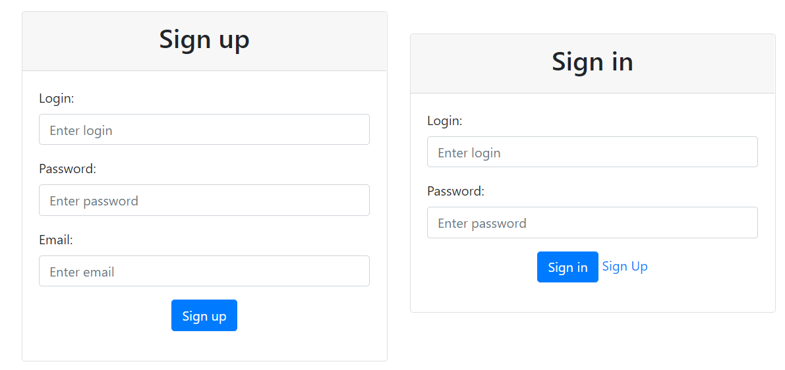
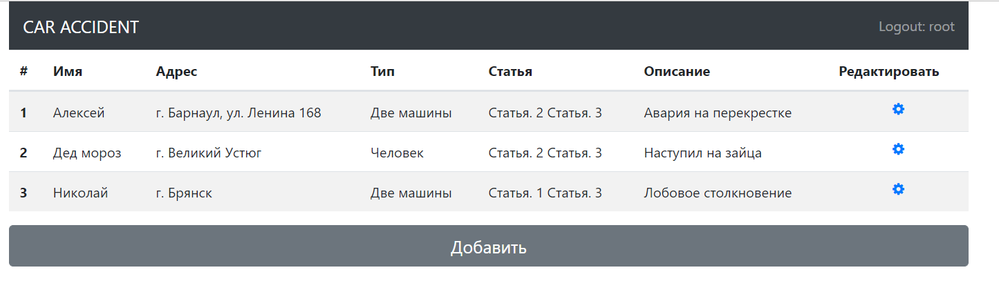
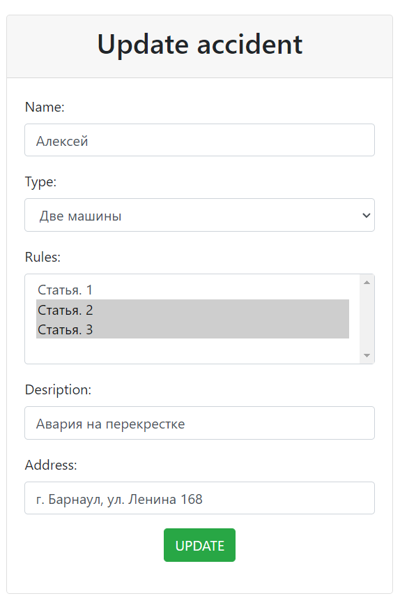

# Car Accident

The project is a service for fixing auto-violations.
After registering and logging in, you see a list of all violations.
Adding and editing a violation is possible using the buttons,
wrong violations and type are uploaded to the form.

## Technologies used

- Spring, Spring MVC
- PostgreSQL
- Spring Data JPA or Spring ORM or Spring JDBC
- Spring Security
- JSP, JSTL
- HTML, Bootstrap

### Functionality

- Authorization and registration

- Create and view all accidents

- Edit accident

